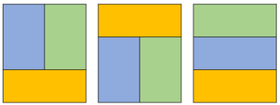

<h2 align="center">Problem B</h2>
<h1 align="center">Mencari Ubin</h1>
<p align="center">Time limit: 1s</p>
<p align="center">Memory limit: 128mb</p>

#### **Deskripsi**
Vini si kuli bangunan sedang ingin memasang beberapa ubin berukuran 2 x 1 ke dalam lantai berukuran 3 _N_. Ubin - ubin tersebut harus tersusun sedemikian rupa dengan memenuhi syarat berikut

1. Setiap petak lantai harus tertutup oleh ubin
2. Tidak boleh ada ubin yang saling tumpang tindih
3. Tidak boleh ada ubin yang tidak menutupi satu petak lantai pun

Ia pun bertanya, ada berapa banyak konfirgurasi pemasangan ubin yang dapat ia lakukan untuk menutupi seluruh lantai itu? _Catatan: Karena hasil bisa sangat besar, keluarkan jawaban dalam modulo_ $10^9$ + 7.

#### Format Masukan
- Baris pertama berisi sebuah bilangan _N_ dimana (1 ≤ N ≤ \(10^{18}\))

#### Format Keluaran
- Sebuah baris berisi bilangan bulat menunjukkan hasil yang diharapkan.

#### Contoh Masukan 1
```
2
```

#### Contoh Keluaran 1
```
3
```

#### Penjelasan Contoh 1
Berikut adalah contoh pemasangan ubin untuk petak berukuran 3 x 2


#### Contoh Masukan 2
```
3
```

#### Contoh Keluaran 2
```
0
```

#### Penjelasan Contoh 2
Tidak ada kombinasi pemasangan ubin yang mungkin untuk lantai berukuran 3 × 3
